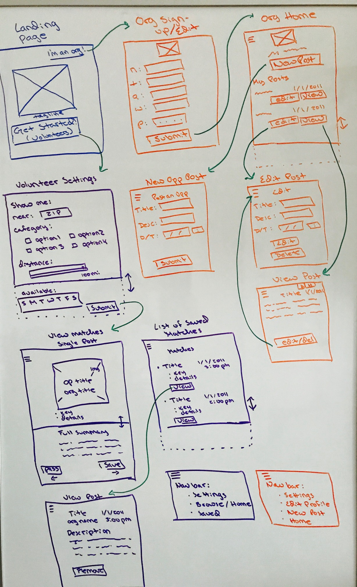
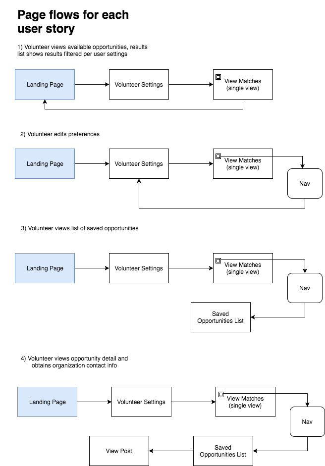
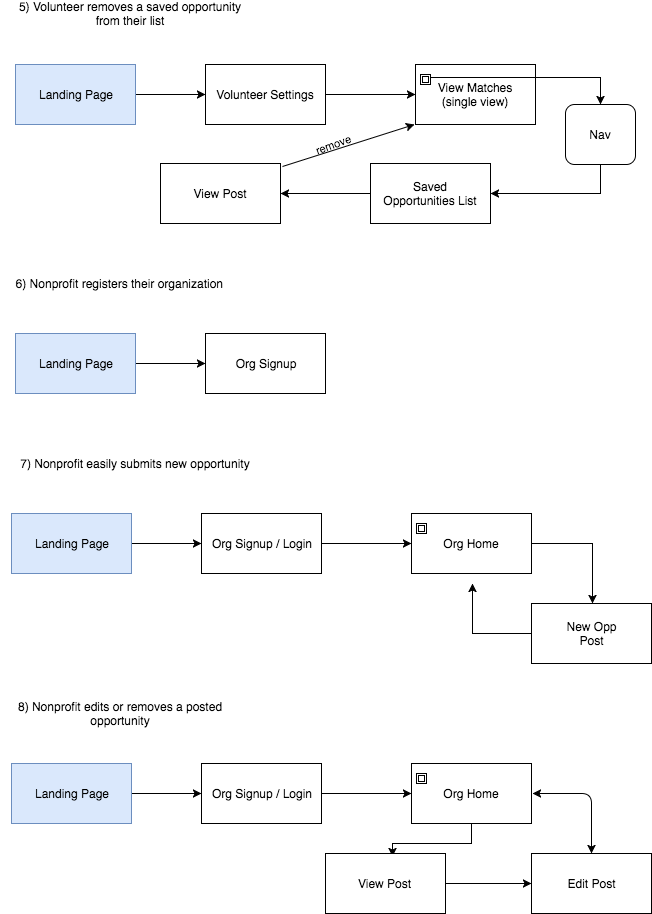
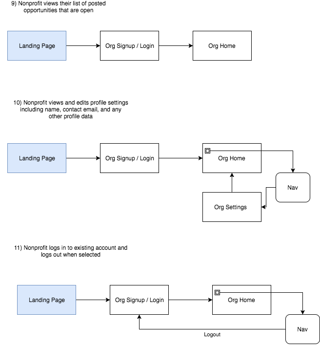

# Voluntr

## Current Version: 0.29.0

<b> A web app that provides a simple platform for nonprofits to connect with potential volunteers</b>

# Table of Contents
1. [Elevator Pitch](#elevator-pitch)
2. [Brief](#brief)
3. [Wireframes](#wireframes)
4. [Pageflow Diagrams](#pageflow-diagrams)
5. [User Stories and Test Plan](#user-stories-and-test-plan)

## Elevator Pitch

This app serves two customers with complementary needs - Nonprofit Organizations and people who want to volunteer their time. 

<b> A Platform for Nonprofits </b>

Many Nonprofit organizations have needs for an increased volunteer base and traditional outreach can often be too costly and time consuming with their limited resources. Voluntr provides a simple platform where a nonprofit can post a volunteer opportunity in seconds while the app takes care of the rest! 

<b> A Simple Resource for Volunteers </b>

People looking to volunteer at a nonprofit often have barriers to being able to volunteer - limited time, limited knowledge of what opportunities are available, a desire to work with a specific group or mission, and more - and scouring the Internet alone can be inefficient and overwhelming. Voluntr will allow volunteers to search according to what's important to them and find opportunities and organizations that fit all of their needs in one quick and simple app!

## Brief

<b>The goals of this project are as follows:</b>
  <ul>
    <li>Offer SaaS (Software as a Service) for Nonprofit Organizations via a responsive web app</li>
    <li>Provide an easy to use location-based search platform for potential volunteers via a responsive web app</li>
    <li>Create a working MVP with a UI that is clean, simple and easy to navigate</li>
    <li>Ensure the success of our goals and ease of future additions by following collaboration best practices</li>
  </ul>

We are targetting both Nonprofit Organizations and potential volunteers. 

 Our <b>Nonprofit audience</b> includes any category of nonprofit organization which is in need of volunteers in any capacity: long term, short term, part time, full time, single event and recurring events. Examples of nonprofits that can find value in our platform: animal shelters and services, food banks, civic organizations, religious organizations and churches, shelters and services for houseless persons, donation drives, fundraising events and more.

Our <b>Volunteer audience</b> includes teens and adults of any socioeconomic class, age, race, ability level and skill level who have access to a mobile device or computer. The demographic location will depend on what nonprofits sign up for the platform. We will first release the app in the Portland, Oregon region with a stretch goal of expanding to have local options available in all metropolitan areas in the United States. 

Both Nonprofit and Volunteer users will be able to access the app through our website on a computer, smartphone or tablet with a stretch goal of releasing this for download as a mobile app. We hope to achieve a clean, simple and modern look and feel. For both Nonprofit and Volunteer users, functionality and ease of use are the main UI goals. On the volunteer side, we are inspired to design a clean user-friendly interface for cycling through potential Nonprofit matches that is similar in feel and function to Tinder.

A noteworthy competitor already in this space is <a href="http://www.volunteermatch.com">volunteermatch.com</a>. Though we recognize that many users have successfully used their platform to serve their needs, we feel that there are key features that we can improve upon: 

  <ul>
    <li>Offer a simplified space for Nonprofits to interact with and use the site directly</li>
    <li>Simplify the search parameters and tools for potential volunteers</li>
    <li>Make the UI cleaner and simpler</li>
    <li>Offer improved responsive design for use on mobile devices</li>
  </ul>

## Wireframes

## Pageflow Diagrams

## User Stories and Test Plan
### We will use manual testing to verify our scenarios and document the results alongside each userstory:

| As a new visitor, I can... | Goal | Status |
| --- | --- |--- |
| discover the app and learn about it's purpose and options | MVP | Passing :white_check_mark: |
| easily find the relevant half of the app to use (volunteer vs organization) | MVP | Passing :white_check_mark: |

| As a Volunteer, I can... | Goal | Status |
| --- | --- |--- |
| view available volunteer opportunities, including photo, non-profit name, and volunteer position title so that I can quickly find opportunities that apply to me without having to sign up  | MVP  | Passing :white_check_mark: |
|set and edit preferences of what day(s) I want to volunteer so I don’t have to search through many postings that don’t meet my schedule | MVP | Passing :white_check_mark: |
| set and edit preferences of where I want to volunteer so I don’t have to search through many postings that don’t meet my location | MVP | Passing :white_check_mark: |
| see that the results list includes opportunity categories that match my preferences  | MVP | Passing :white_check_mark: |
| save an opportunity post to a local list so that I can re-visit it later  | MVP | Passing :white_check_mark: |
| view the saved opportunity to get contact information for volunteer organizations so that I can get in touch outside of the app to discuss opportunities further  | MVP | Passing :white_check_mark: |
| remove a saved opportunity from my list  | MVP | Passing :white_check_mark: |

| As a Nonprofit, I can... | Goal | Status |
| --- | --- |--- |
| register my organization on Voluntr | MVP | Passing :white_check_mark: |
| easily submit open volunteer opportunities | MVP | Not Passing :red_circle: |
| edit or remove a posted opportunity  | MVP  | Not Passing :red_circle: |
| view the list of posted opportunities that are open  | MVP | Passing :white_check_mark: |
| view and edit profile settings for my organization, including name, contact email, and any other profile data  | MVP | Not Passing :red_circle: |
| log in to my existing account and logout when I'm done  | MVP | Not Passing :red_circle: |

Our stretch goals include adding Python unit and acceptance tests using pytest and pytest-BDD, and some JavaScript unit tests with tap.  
