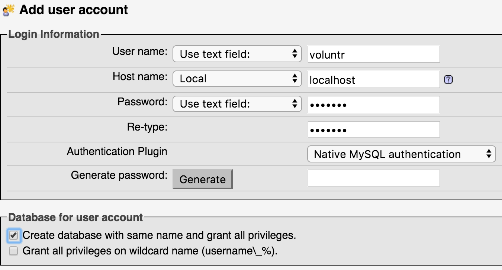

# Setup

Follow these steps to successfully run this app on your machine!

## 1. Requirements

1. [Install Git](https://git-scm.com/book/en/v2/Getting-Started-Installing-Git)

    Check that it installed correctly:

      ```sh
      which git
      ```

    If Git is installed, this will return the path `/usr/local/bin/git`  
    If you get an error message, check the Git documentation and   
    try again.
    
    
2. Install Python 3.

    - <b>Any OS: </b>use a downloadable installer for any operating system: https://www.python.org/downloads/

    - <b>macOS</b> using [Homebrew](https://brew.sh/):

        ```sh
        brew install python3
        ```

    - <b>Windows</b> using [Scoop](http://scoop.sh/):

        ```sh
        scoop install python3
        ```

    - Once installed, verify that it's installed correctly:

        ```sh
        which python3
        ```

        If installed, this will return the path `/usr/local/bin/python3`

3. [Install Flask](http://flask.pocoo.org/docs/0.12/installation/)

    Check that it installed correctly:

      ```sh
      flask --version
      ```
      
      If Flask is installed, this will return your version.  
      We are using Flask 0.12.2, so check that your version matches.


## 2. Download the project.

1. [Fork this repository](https://github.com/hendricksonsarahl/voluntr)

2. Clone the git repository to your machine

      ```sh
      git clone git@github.com:YOUR_GITHUB_USERNAME/voluntr.git
      ```

3. Move into that repository

      ```sh
      cd voluntr
      ```

## 3. Set up development environment:

1. Set up a [Python Virtual Environment (venv)](https://docs.python.org/3/library/venv.html):

    ```sh
    python3 -m venv venv
    source venv/bin/activate
    ```

2. Install dependencies from the Voluntr requirements.txt file

    ```sh
    pip install -r requirements.txt
    ```

3. Setup a local mySQL database using [MAMP](https://www.mamp.info/en/downloads/)

    - Select the download for your OS (MAMP, <b>not</b> MAMP Pro)
  
    - Open MAMP, and press the Start Servers button. This should open the MAMP WebStart page in your web browser. 

    - Create a new user account and database through phpMyAdmin, found in the Tools menu.

        

    - Make sure your username and password are exactly:

      - username: voluntr
      - password: voluntr

## 4. Run the app.

1. Run:

    ```sh
    python voluntr.py
    ```

    The app will now be running in your browser at [http://localhost:5000/](http://localhost:5000/)
    - Once the app is running, first visit the /drop_create route to load sample data.
    - <b>Important: You must be running 'localhost' and not '127.0.0.1' in your browser for Organization sign in to function properly.</b>

## 5. Building JavaScript Files

Our JavaScript source code files are found in `src/js`. These are the only JavaScript files that should be directly edited. They are processed and bundled by Webpack, with the resulting files produced in `static/build`. These are the files that will be directly loaded by the browser.

To generate JavaScript files,

1. Install Node.js. Installer files are available for many platforms at [https://nodejs.org/en/download/](https://nodejs.org/en/download/).
2. Install the Webpack command-line application with:	```npm install -g webpack``` 
3. From the `voluntr` project directory, locally install the project dependencies with:

	```
	npm install
	```
4. Compile updated bundles with:

	```
	npm run build
	```
	This command will generate updated bundles, and then start watching for changes to source files, which then trigger a new build. **Whenever you plan to work with JavaScript code, you should begin by running this command and leaving its terminal window open and running in the background.**

## 6. Testing.
### JavaScript

To run the JavaScript unit tests, 

1. Install Node.js. Installer files are available for many platforms at [https://nodejs.org/en/download/](https://nodejs.org/en/download/).

2. From the `voluntr` project directory, locally install the project dependencies with:

	```
	npm install
	```

3. If it isn't already running, run the app with: 

  ```sh
  python voluntr.py
  ```

4.  Run the existing unit tests with:

	```
	npm test
	```

5.  Write new test files in the `tests/js` folder.	


### Once you are ready to code, please see our [guidelines for contributing](https://github.com/hendricksonsarahl/voluntr/blob/master/CONTRIBUTING.md)

---

For problems related to these instructions or bugs in our code, please [open a new issue](https://github.com/hendricksonsarahl/voluntr/issues/new)
